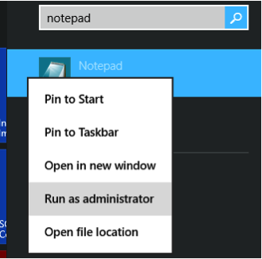
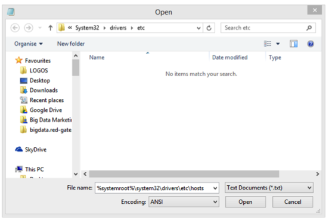
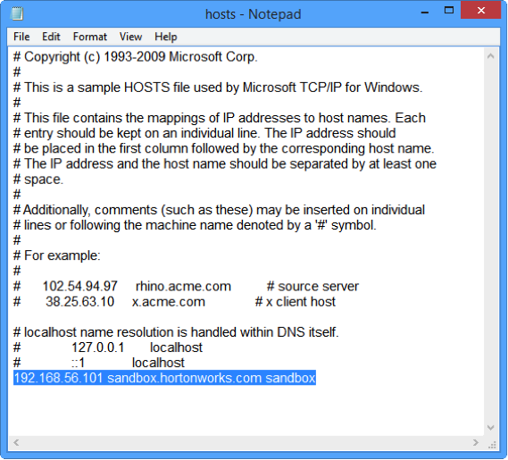
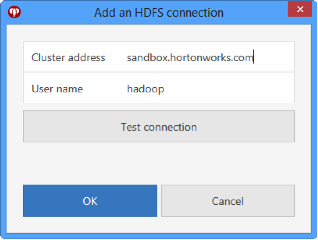
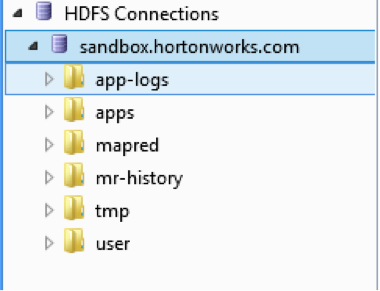

## Community Tutorial 05: How to use HDFS Explorer to manage files on the Hortonworks Sandbox

**This tutorial is from the Community part of tutorial for [Hortonworks Sandbox](http://hortonworks.com/products/sandbox) - a single-node Hadoop cluster running in a virtual machine. [Download](http://hortonworks.com/products/sandbox) the Hortonworks Sandbox to run this and other tutorials in the series.** 

**This tutorial was validated with Sandbox 2.0**

### Summary

This tutorial explains how to quickly browse, upload and download files to and from the Hortonworks sandbox from within Windows using HDFS Explorer. HDFS Explorer is a Free Windows Explorer based GUI file manager for the Hadoop Distributed File System (HDFS).

In this tutorial we will walk through how to connect HDFS Explorer to the Hortonworks Sandbox, and explain what familiar functionality you will then have access to.

### Prerequisites 

1.  Download and start [Hortonworks Sandbox 2.0](http://hortonworks.com/products/hortonworks-sandbox/#install)
2.  Download and install [HDFS Explorer](http://bigdata.red-gate.com/hdfs-explorer.html)

###Step one: Enable access to the Hortonworks Sandbox from your local machine.
In order to access the Hortonworks Sandbox with HDFS Explorer you will need to create an entry in your hosts file. 

To do this launch Notepad [with administrator privileges](http://windows.microsoft.com/en-gb/windows7/how-do-i-run-an-application-once-with-a-full-administrator-access-token).

In Notepad, click **File > Open**, paste the following into the file name field, and then click Open:
 
`%systemroot%\system32\drivers\etc\hosts`

Add the following code to the end of the hosts file: 

`192.168.56.101 sandbox.hortonworks.com sandbox`

… and save the changes.

**Note: if you have configured your Sandbox to use a different IP address, then you'll need to change the IP address in the snippet above.**

###Step Two: Connect to your Sandbox in HDFS Explorer.

* Launch HDFS Explorer
* Add a new connection (**File > Add Connection**)
* Enter the following credentials and click OK:

* **Cluster address:** `sandbox.hortonworks.com`
* **User name:** `hadoop`

**Note: HDFS Explorer supports multiple connections. To create additional connections, simply click file > add connection again. **

###Next Steps
Once HDFS Explorer is connected to the Hortonworks Sandbox it can be used to rapidly upload files and data and download query results using the familiar Windows Explorer-like GUI.

HDFS Explorer supports common Windows Explorer functionality including:

* Copying, moving, renaming and deleting files
* Drag and drop 
* Fast navigation of folder structures
* Support for multiple windows
* Bookmarked locations

For additional documentation on HDFS Explorer, visit the [HDFS Explorer website](http://bigdata.red-gate.com/hdfs-explorer.html).
