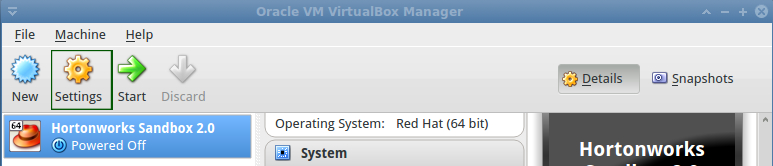
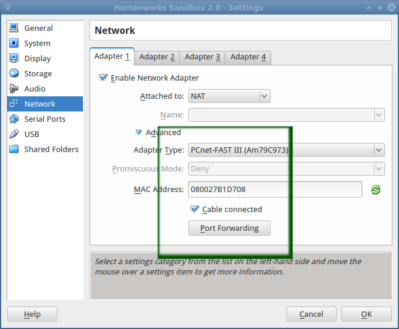
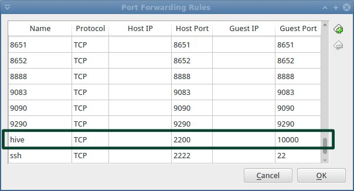
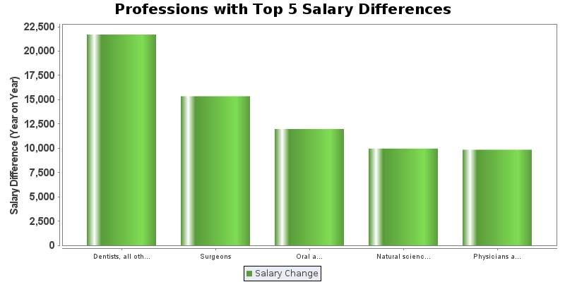

## Community Tutorial 06: Java-Hive Integration - Salary Delta Analysis and Visualization Using Hive, Java and JFreeChart

**This tutorial is from the Community part of tutorial for [Hortonworks Sandbox](http://hortonworks.com/products/sandbox) - a single-node Hadoop cluster running in a virtual machine. [Download](http://hortonworks.com/products/sandbox) the Hortonworks Sandbox to run this and other tutorials in the series.**

### Introduction

Ever wanted to run [Hive](http://hive.apache.org "Hive") Queries from your own Java application? This tutorial helps you to do just that :) This tutorial takes up a sample scenario - Salary Delta Analysis in Java using Hive. To complete the picture, visualization of the analysis is created using JFreeChart, a open source charting API.

### Pre-requisites

To follow the steps in this tutorial, your computer must have the following items installed and running.

1. Hortonworks Sandbox VM
2. Any Java Development & Runtime Environment (Open JDK is also good)
3. Preferably a Java IDE like Eclipse (If you use any other IDE like Intellij Idea or Netbeans, that is ok).  This tutorial explains the steps using Eclipse.
4. A working internet connection (to download the files mentioned in the tutorial

### Files to be downloaded

1. **Apache Hive Installer:**  Hold on! We are not going to install Apache Hive.  In fact, Hive is there in Hortonworks Sandbox itself.  We need only "lib" directory present in the installer archive.  We will be using this lib directory's contents as Java library. Download Location: <http://www.apache.org/dyn/closer.cgi/hive/>  \[**Note**: Extract the downloaded Hive archive file and ensure that it contains a "lib" directory\]

2. **JFreeChart Library:** JFreeChart is the open source charting library which we will use for creating graphical charts. Download Location: <http://sourceforge.net/projects/jfreechart/files/latest/download?source=files> \[**Note**: Extract the downloaded JFreeChart archive file and ensure that it contains a "lib" directory\]

### Steps Involved
####Eclipse Project Setup
1. Create an Eclipse Java Project with name "HiveJavaIntegration".
2. Go to Project Properties window and in "Java Build Path" section, click on "Add External Jars"
3. In the JAR Selection dialog, select all jars in the "lib" directory of Hive and press OK.  This will add all Hive library jars to the eclipse project.
4. Similarly, add all the jars from the "lib" directory of JFreeChart as well.

####Hortonworks Sandbox - Port Forwarding Setup
By default, the port mapping for the Hive2 service of Hortonworks sandbox is missing in the Virtualbox entries.  Lets go and create that one.

Right click the Virtual Machine in the Virtualbox and select "Settings".



In the Settings dialog box, choose "Network" section and click on "Port Forwarding" button.



Add a new entry in the "Port Forwarding Rules" for hive (hive-tcp-2200-10000) as shown in the figure below.



Now, Hive2 Service can be reached from a java program running in Eclipse.

####Coding the Java Class
Create a Java class with name "HiveDataFetcher" and following code in it.

```java
package com.vivekGanesan.hadoopJavaCharts;

import java.sql.Connection;
import java.sql.DriverManager;
import java.sql.ResultSet;
import java.sql.SQLException;
import java.sql.Statement;

import org.jfree.data.category.DefaultCategoryDataset;

public class HiveDataFetcher {
    
	private String hiveHostName = "127.0.0.1"; //change this ip address if required
	private String hiveForwardedPort = "2200"; //this is the port number, which is configured to forward to Sandbox's 10000 port
	
	public DefaultCategoryDataset getDataFromHive() throws SQLException{
		DefaultCategoryDataset dataset = new DefaultCategoryDataset();
		ResultSet rs  = runQueryAndGetResult();
		System.out.println("Populating dataset for chart...");
		while(rs.next()){
			dataset.setValue(rs.getDouble("salary_difference"), "Salary Change", rs.getString("job_category"));
		}
		System.out.println("Dataset population complete!");
		return dataset;
	}
	
	private ResultSet runQueryAndGetResult() throws SQLException{
		 try {
			    String driverName = "org.apache.hive.jdbc.HiveDriver";
				Class.forName(driverName);
			    } catch (ClassNotFoundException e) {
			      // TODO Auto-generated catch block
			      e.printStackTrace();
			      System.exit(1);
			    }
			    Connection con = DriverManager.getConnection("jdbc:hive2://"+hiveHostName + ":" +hiveForwardedPort + "/default", "", "");
			    Statement stmt = con.createStatement();
			    String sql = "SELECT s07.description AS job_category, s07.salary , s08.salary ,  (s08.salary - s07.salary) AS salary_difference FROM  sample_07 s07 JOIN sample_08 s08 ON ( s07.code = s08.code) WHERE s07.salary < s08.salary SORT BY s08.salary-s07.salary DESC LIMIT 5";
			    System.out.println("Running: " + sql);
			    ResultSet res = stmt.executeQuery(sql);		
			    System.out.println("Query execution complete");
			    return res;
	}

}


```

Also, create another class "SalaryDifferenceChartPlotter" with the following code.

```java
package com.vivekGanesan.hadoopJavaCharts;

import java.awt.BasicStroke;
import java.awt.Color;
import java.awt.Font;
import java.io.File;
import java.io.IOException;
import java.sql.SQLException;

import org.jfree.chart.ChartFactory;
import org.jfree.chart.ChartUtilities;
import org.jfree.chart.JFreeChart;
import org.jfree.chart.plot.CategoryPlot;
import org.jfree.chart.plot.PlotOrientation;
import org.jfree.chart.renderer.category.CategoryItemRenderer;
import org.jfree.util.ShapeUtilities;

public class SalaryDifferenceChartPlotter {
    
	private static String outputFilePath = "/home/vivek/Desktop/salary_difference_chart.jpg";
	public void plotChart() throws SQLException, IOException{
		
		 JFreeChart chart = ChartFactory.createBarChart("Professions with Top 5 Salary Differences",
	                null, "Salary Difference (Year on Year)", new HiveDataFetcher().getDataFromHive(), PlotOrientation.VERTICAL,
	                true, true, false);

	        chart.setBackgroundPaint(Color.white);
	        chart.setBorderPaint(Color.WHITE);

	        chart.getLegend().setBackgroundPaint(new Color(233,236,244));


	        final CategoryPlot plot = chart.getCategoryPlot();

	        plot.setBackgroundPaint(Color.white);
	        plot.getRangeAxis().setLabelFont(new Font("Arial", Font.BOLD, 15));


	        Font font = new Font("Arial", Font.PLAIN, 15);
	        plot.getDomainAxis().setTickLabelPaint(Color.DARK_GRAY);
	        plot.getDomainAxis().setTickLabelFont(new Font("Arial", Font.PLAIN, 10));

	        plot.getRangeAxis().setTickLabelPaint(Color.DARK_GRAY);
	        plot.getRangeAxis().setTickLabelFont(new Font("Arial", Font.BOLD, 15));


	        CategoryItemRenderer renderer = plot.getRenderer();


	        renderer.setSeriesStroke(0,new BasicStroke(2f));
	        
        
	        renderer.setSeriesShape(0, ShapeUtilities.createDiamond(5) );
	        
	        renderer.setSeriesPaint(0,new Color(90,155,59));
	       
	        plot.setRenderer(renderer);
	        System.out.println("Saving chart as JPEG...");
	        ChartUtilities.saveChartAsJPEG(new File(outputFilePath), chart, 800, 400);
	        System.out.println("Chart saved at "+ outputFilePath);
	}
	
	public static void main (String args[]) throws SQLException, IOException{
		new SalaryDifferenceChartPlotter().plotChart();
	}

}


```

Remember to change the "outputFilePath" variable to suit your needs.

####Run and Generate Chart
1. Start the Hortonworks Sandbox VM.
2. After service has started, go to Eclipse, right click on "SalaryDifferenceChartPlotter" java class and select "Run -> As Java Application".
3. Check if chart has been generated in the output path specified in code.



####Next Steps
Tweak the code and play around :)

