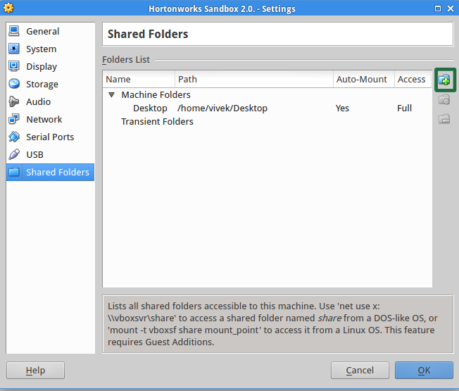
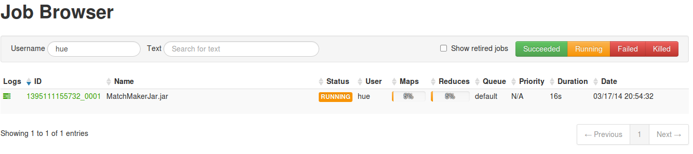
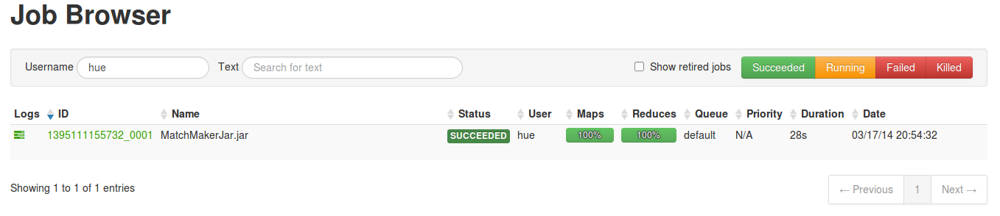
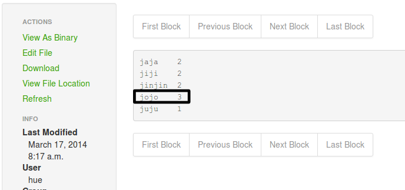

## Community Tutorial 09: Write and Run Your Own YARN Java Program - Poll Result Analysis Using YARN, Java and Eclipse

**This tutorial is from the Community part of tutorial for [Hortonworks Sandbox](http://hortonworks.com/products/sandbox) - a single-node Hadoop cluster running in a virtual machine. [Download](http://hortonworks.com/products/sandbox) the Hortonworks Sandbox to run this and other tutorials in the series.**

### Introduction

Ever wanted to code your own [YARN](http://hadoop.apache.org/docs/r2.3.0/hadoop-yarn/hadoop-yarn-site/YARN.html "YARN") application using Java and run it on Hortonworks Sandbox? This tutorial helps you to do just that :) This tutorial takes up a sample scenario - Poll Result Analysis using YARN, Java and Eclipse. Of course, we will also be using Hue, the Hadoop user interface presented by Hortonworks Sandbox.

### Pre-requisites

To follow the steps in this tutorial, your computer must have the following items installed and running.

1. Hortonworks Sandbox VM
2. Java Version 6 Development & Runtime Environment (Open JDK is also good)
3. Preferably a Java IDE like Eclipse (If you use any other IDE like Intellij Idea or Netbeans, that is ok).  This tutorial explains the steps using Eclipse.
4. A working internet connection (to download the files mentioned in the tutorial

### File to be downloaded

**Hadoop Tar ball:** Access the Hortonworks Sandbox and know the version of Hadoop used in it.  [Download](http://www.apache.org/dyn/closer.cgi/hadoop/common/ "Download a Hadoop Release") the tar.gz file of same version as the one present in the Hortonworks Sandbox.   
**Note**: Extract the downloaded Hadoop tar.gz file and ensure that it contains the following files:

    a. share/hadoop/common/hadoop-common-*.jar
    b. share/hadoop/mapreduce/hadoop-mapreduce-client-core-*.jar
    c. share/hadoop/mapreduce/hadoop-mapreduce-client-jobclient-*.jar

### Explanation of the Use Case
A fictional use case is presented here, in order to enable you to easily understand the functionality and power of YARN, without finding it overwhelming or boring.

####General Elections in Utopia
In the democratic country of Utopia, the General Elections (Polls) for the position of President was conducted some days ago.  About five million Utopian Citizens participated in the elections with full enthusiasm and cast their votes to the candidate whom they think deserves the position.  Because of large population, the elections were conducted in 1000 polling booths, geographically separated, so that a citizen can vote from his nearest booth.

There were five contestants for the post.  The names of the candidates are as follows:
1. Jaja
2. Jiji
3. Jojo
4. Juju
5. Jinjin

You are the Chief Election Commissioner, the person responsible for fair conduct of the entire election process.  Now that the polls are over, half of your worries are over.  But, just a half!  The remaining half is to ensure that the vote-counting happens without any error.  You are responsible for announcing the next president of the country.

As the Chief Election Commissioner, you have been given the power to use any resource of the country judiciously, for the purpose of counting votes.  As you have been planning, from the beginning, to use the computational resources of the country for this purpose, you chose Hadoop YARN to do the dirty job of vote counting for you.

Your pre-planning skills have helped you in taking each vote as an electronic vote, where every vote cast in every polling booth is written into the booth's text (.txt) file as one line.  This one line will be the name of the candidate who received the vote.

For example, if the first vote in the polling booth 5 goes to Jaja, the `booth_5.txt` file would look like the one below:

```
Jaja
```
If the second vote goes to Jojo, the file would look like the one below:

```
Jaja
Jojo
```
...and so on!

You have to announce the results by this evening, before 5 PM.  It is already 10 AM.  As it happens to be, you are a good Java Programmer. Now, roll up your sleeves and follow the instructions to count the votes and announce the results by 5 PM.

### Instructions
####Eclipse Project Setup
1. Create an Eclipse Java Project with name `UtopiaVoteCount`.
2. Go to Project Properties window and in "Java Build Path" section, click on "Add External Jars"
3. In the JAR Selection dialog, select the following jars from the extracted Hadoop tar.gz file.

        a. share/hadoop/common/hadoop-common-*.jar
    	b. share/hadoop/mapreduce/hadoop-mapreduce-client-core-*.jar
    	c. share/hadoop/mapreduce/hadoop-mapreduce-client-jobclient-*.jar


####Code the Mapper Class
In the eclipse project created above, create a new Java Class file with name `VoteCountMapper` and write the following code in it.  This will be the Mapper Class.

```java
package com.vivekGanesan;

import java.io.IOException;
import org.apache.hadoop.io.IntWritable;
import org.apache.hadoop.io.Text;
import org.apache.hadoop.mapreduce.Mapper;

public class VoteCountMapper extends Mapper<Object, Text, Text, IntWritable> {
	
	private final static IntWritable one = new IntWritable(1);
	
	@Override
	public void map(Object key, Text value, Context output) throws IOException,
			InterruptedException {
		
		//If more than one word is present, split using white space.
		String[] words = value.toString().split(" ");
		//Only the first word is the candidate name
		output.write(new Text(words[0]), one);
	}
}

```
####Code the Reducer Class
In the eclipse project created above, create a new Java Class file with name `VoteCountReducer` and write the following code in it.  This will be the Reducer Class.

```java
package com.vivekGanesan;

import java.io.IOException;
import java.util.Iterator;
import org.apache.hadoop.io.IntWritable;
import org.apache.hadoop.io.Text;
import org.apache.hadoop.mapreduce.Reducer;

public class VoteCountReducer extends Reducer<Text, IntWritable, Text, IntWritable> {
	
	@Override
	public void reduce(Text key, Iterable<IntWritable> values, Context output)
			throws IOException, InterruptedException {
		int voteCount = 0;
		Iterator<IntWritable> iterator = values.iterator();
		while (iterator.hasNext()) {
			voteCount += iterator.next().get();
		}		
		output.write(key, new IntWritable(voteCount));
	}
}
```

####Code the YARN Application/Driver Class
In the eclipse project created above, create a new Java Class file with name `VoteCountApplication` and write the following code in it.  This will be the Application/Driver Class.

```java
package com.vivekGanesan;

import org.apache.hadoop.conf.Configuration;
import org.apache.hadoop.fs.Path;
import org.apache.hadoop.io.IntWritable;
import org.apache.hadoop.io.Text;
import org.apache.hadoop.mapreduce.Job;
import org.apache.hadoop.mapreduce.lib.input.FileInputFormat;
import org.apache.hadoop.mapreduce.lib.input.TextInputFormat;
import org.apache.hadoop.mapreduce.lib.output.FileOutputFormat;
import org.apache.hadoop.mapreduce.lib.output.TextOutputFormat;


public class VoteCountApplication {
	
	public static void main(String[] args) throws Exception {
		
		if (args.length != 2) {
			System.out.println("usage: [input] [output]");
			System.exit(-1);
		}

		Job job = Job.getInstance(new Configuration());
		job.setOutputKeyClass(Text.class);
		job.setOutputValueClass(IntWritable.class);

		job.setMapperClass(VoteCountMapper.class);
		job.setReducerClass(VoteCountReducer.class);

		job.setInputFormatClass(TextInputFormat.class);
		job.setOutputFormatClass(TextOutputFormat.class);

		FileInputFormat.setInputPaths(job, new Path(args[0]));
		FileOutputFormat.setOutputPath(job, new Path(args[1]));

		job.setJarByClass(VoteCountApplication.class);

		job.submit();
	}
}
```

####Setting Java Version - Compiler Options
Hortonworks Sandbox VM contains Java version 6.  So, we need to compile our classes using Java Version 6 in order to avoid Version Mismatch runtime exception.  To ensure compilation using Java Version 6, follow the below instructions.

1. Right-click on the Java Project `UtopiaVoteCount` and click on `Properties` menu option.
2. Navigate to "Java Compiler" section.
3. In the "Compiler Compliance Level" field, select `1.6` and click on Apply button.
4. Click on OK Button.  If necessary, let the project re-build itself.


####Creating a Java Archive (JAR) File
To test your application's error scenario, right-click on `VoteCountApplication` class and choose Run as -> Java Application.  This should print the following error message in the eclipse console.

```
usage: [input] [output]
```

Now, let us export the Java Project to a JAR file.

1. Right-click on the Java Project `UtopiaVoteCount` and click on `Export...` menu option.
2. In the Export dialog, select Java -> Runnable JAR File and click on Next.
3. In the Launch configuration, choose `UtopiaVoteCount` project.  Choose export destination as ~/Desktop/UtopiaVoteCount.jar. Here, ~ means the user's home directory. Choose "Extract required libraries into generated JAR" option and click on Finish.  Click OK for all the ensuing warning messages.  Ignore if any warnings are displayed after export.
4. Using a file browser, check if UtopiaVoteCount.jar exists in ~/Desktop directory.

####VirtualBox Shared Folder Settings
We are going to setup the directory ~/Desktop to be shared between our Host computer and the Hortonworks Sandbox.  We need this to transfer the UtopiaVoteCount.jar to the Hortonworks Sandbox.

1. Before powering up the Hortonworks Sandbox, open the settings of Hortonworks Sandbox VM.
2. Navigate to "Shared Folders" section.
3. Click on the "Add Shared Folder" button present at the right of the dialog box.
4. In the Folder Path, browse to your Desktop folder.
5. Check the "Auto-mount" check box.
6. Click on OK.

Now, you can access your ~/Desktop folder from within Hortonworks Sandbox.



####Verify Shared Folder Access
Let us check if you can access the UtopiaVoteCount.jar file present in ~/Desktop folder, from within the Hortonworks Sandbox.

Boot up your Hortonworks Sandbox VM.  In the Virtual machine's window, press `Alt+F5` and login as root/hadoop.

To change to mounted directories, type `cd /media/` and press Enter.  Now, type `ls` and press Enter to bring up a list of shared folders.  This should show `sf_Desktop` as an entry.  This means that you can access ~/Desktop of your computer from within Hortonworks Sandbox VM.

####Copy JAR to hue Home Directory
We are going to run our YARN Job as `hue` user.  So, we need to copy the `UtopiaVoteCount.jar` to that user's home directory `/usr/lib/hue`, with permissions for `hue` to execute the same.

In the command prompt, enter the command `cp /media/sf_Desktop/UtopiaVoteCount.jar /usr/lib/hue/` and press Enter.

Now, enter the command `cd /usr/lib/hue/ ; chmod 777 UtopiaVoteCount.jar` and press Enter.  This will make the JAR file readable and executable by all.

####Test Input Data Setup
For our YARN job to execute, we need test input data.  The test input data is nothing but a set of files, having multiple lines, one name in each line.  So, go to [File Browser](http://localhost:8000/filebrowser/) and create a directory `VoteCountInput` under `/user/hue` directory.  Inside the directory, create two files booth-1.txt and booth-2.txt with sample contents (Multiple lines, one name in each line).

####Fire YARN Job Execution
We are going to run our YARN Job as `hue` user.  Let us now change to the user `hue` by typing `su - hue` command pressing enter.  Now, you are the user `hue`.

Now, we can use `yarn` command to fire the job. Run the following command :

```
yarn jar UtopiaVoteCount.jar /user/hue/VoteCountInput /user/hue/VoteCountOutput
```

Seeing the way the program is written, the above command means that the input files lie in /user/hue/VoteCountInput directory and the output will be produced in /user/hue/VoteCountOutput directory in HDFS.

####Monitor YARN Job Execution
You can monitor the progress of the triggered job using [Job Browser](http://localhost:8000/jobbrowser/).  If you wish, you could take a peek into the generated log files.





####View Vote Count Results
The final, consolidated vote count for each candidate can be found in a file present in the directory `/user/hue/VoteCountOutput`.  View this file using [File Browser](http://localhost:8000/filebrowser/) to know the number of votes each candidate got.



Assuming that you spent approximately an hour, including the setup and running of YARN job, you could be ready with the election results by 11 AM.  Then what, party until 5 PM :)

####Next Steps
Tweak the code and see what other use cases you can solve using YARN MapReduce.
