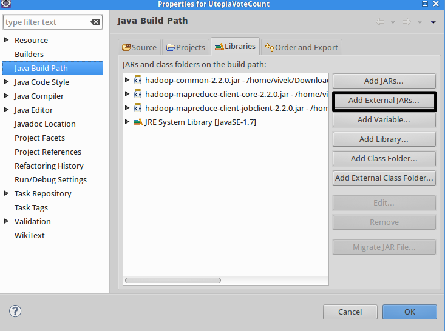
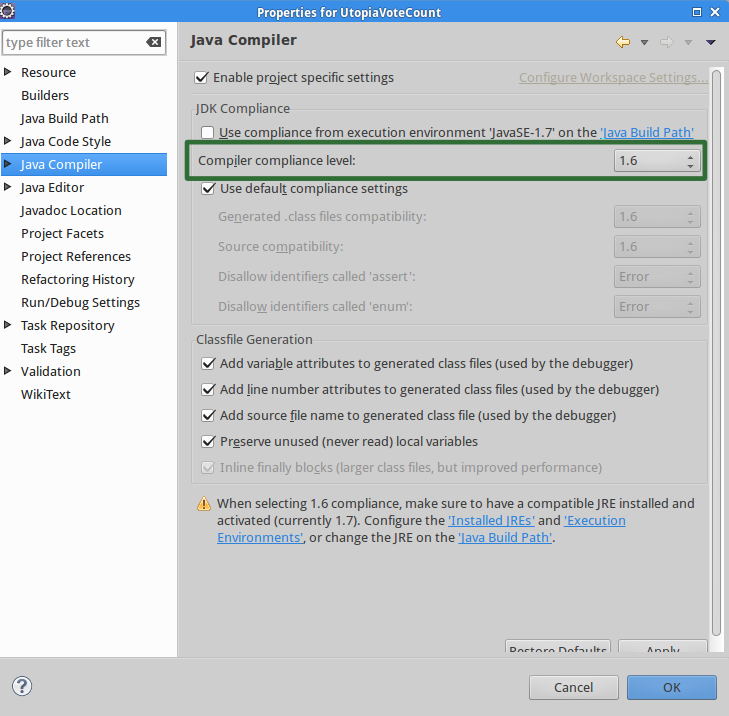
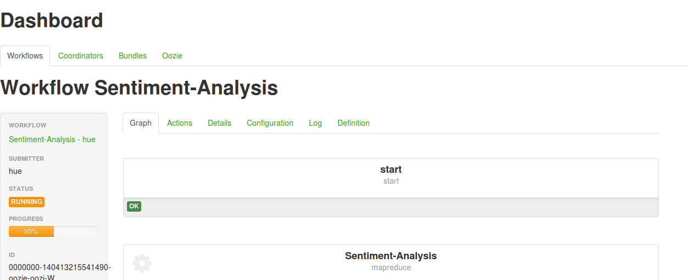

## Community Tutorial 10: Sentiment Analysis Workflow using Oozie, MapReduce and Pig

**This tutorial is from the Community part of tutorial for [Hortonworks Sandbox](http://hortonworks.com/products/sandbox) - a single-node Hadoop cluster running in a virtual machine. [Download](http://hortonworks.com/products/sandbox) the Hortonworks Sandbox to run this and other tutorials in the series.**

### Introduction

Ever wanted to design your own [Oozie](https://oozie.apache.org/‎) workflow and run it on Hortonworks Sandbox? This tutorial helps you to do just that :) This tutorial takes up a sample scenario - Sentiment Analysis Workflow using Oozie, MapReduce and Pig. Of course, we will also be using Hue, the Hadoop user interface presented by Hortonworks Sandbox.

### Pre-requisites

To follow the steps in this tutorial, your computer must have the following items installed and running.

1. Hortonworks Sandbox VM
2. Java Version 6 Development & Runtime Environment (Open JDK is also good)
3. Preferably a Java IDE like Eclipse (If you use any other IDE like Intellij Idea or Netbeans, that is ok).  This tutorial explains the steps using Eclipse.
4. A working internet connection (to download the files mentioned in the tutorial)

### File to be downloaded

**Hadoop Tar ball:** Access the Hortonworks Sandbox and know the version of Hadoop used in it.  [Download](http://www.apache.org/dyn/closer.cgi/hadoop/common/ "Download a Hadoop Release") the tar.gz file of same version as the one present in the Hortonworks Sandbox.   
**Note**: Extract the downloaded Hadoop tar.gz file and ensure that it contains the following files:

    a. share/hadoop/common/hadoop-common-*.jar
    b. share/hadoop/mapreduce/hadoop-mapreduce-client-core-*.jar
    c. share/hadoop/mapreduce/hadoop-mapreduce-client-jobclient-*.jar

### Explanation of the Use Case
A fictional use case is presented here, in order to enable you to easily understand the functionality and power of Oozie, without finding it overwhelming or boring. 

####Sentiment Analysis using Twitter tweets
Given the tweets tweeted in a particular period, you are supposed to find the most popular actor among five candidates.  The names of the candidates are as follows:  
1. Jaja  
2. Jiji  
3. Jojo  
4. Juju  
5. Jinjin  

### Instructions
####Eclipse Project Setup
1. Create an Eclipse Java Project with name `SentimentAnalysis`.
2. Go to Project Properties window and in "Java Build Path" section, click on "Add External Jars"
3. In the JAR Selection dialog, select the following jars from the extracted Hadoop tar.gz file.

        a. share/hadoop/common/hadoop-common-*.jar
        b. share/hadoop/mapreduce/hadoop-mapreduce-client-core-*.jar
    	c. share/hadoop/mapreduce/hadoop-mapreduce-client-jobclient-*.jar



####Code the Mapper Class
In the eclipse project created above, create a new Java Class file with name `SentimentAnalysisMapper` and write the following code in it.  This will be the Mapper Class.

```java
package com.vivekGanesan;

import java.io.IOException;

import org.apache.hadoop.io.IntWritable;
import org.apache.hadoop.io.LongWritable;
import org.apache.hadoop.io.Text;
import org.apache.hadoop.mapred.MapReduceBase;
import org.apache.hadoop.mapred.Mapper;
import org.apache.hadoop.mapred.OutputCollector;
import org.apache.hadoop.mapred.Reporter;

public class SentimentAnalysisMapper extends MapReduceBase implements
		Mapper<LongWritable, Text, Text, IntWritable> {

	@Override
	public void map(LongWritable key, Text value,
			OutputCollector<Text, IntWritable> output, Reporter reporter)
			throws IOException {

		String tweetText = value.toString();
		if (tweetText.toUpperCase().contains("JAJA")) {
			output.collect(new Text("JAJA"), new IntWritable(1));
		} else if (tweetText.toUpperCase().contains("JIJI")) {
			output.collect(new Text("JIJI"), new IntWritable(1));
		} else if (tweetText.toUpperCase().contains("JOJO")) {
			output.collect(new Text("JOJO"), new IntWritable(1));
		} else if (tweetText.toUpperCase().contains("JUJU")) {
			output.collect(new Text("JUJU"), new IntWritable(1));
		} else if (tweetText.toUpperCase().contains("JINJIN")) {
			output.collect(new Text("JINJIN"), new IntWritable(1));
		}

	}

}
```
####Code the Reducer Class
In the eclipse project created above, create a new Java Class file with name `SentimentAnalysisReducer` and write the following code in it.  This will be the Reducer Class.

```java
package com.vivekGanesan;

import java.io.IOException;
import java.util.Iterator;

import org.apache.hadoop.io.IntWritable;
import org.apache.hadoop.io.Text;
import org.apache.hadoop.mapred.MapReduceBase;
import org.apache.hadoop.mapred.OutputCollector;
import org.apache.hadoop.mapred.Reducer;
import org.apache.hadoop.mapred.Reporter;

public class SentimentAnalysisReducer extends MapReduceBase implements
		Reducer<Text, IntWritable, Text, IntWritable> {

	@Override
	public void reduce(Text key, Iterator<IntWritable> values,
			OutputCollector<Text, IntWritable> output, Reporter reporter)
			throws IOException {
		int mentionCount = 0;
		while (values.hasNext()) {
			mentionCount += values.next().get();
		}
		output.collect(key, new IntWritable(mentionCount));
	}

}
```
####Setting Java Version - Compiler Options
Hortonworks Sandbox VM contains Java version 6.  So, we need to compile our classes using Java Version 6 in order to avoid Version Mismatch runtime exception.  To ensure compilation using Java Version 6, follow the below instructions.

1. Right-click on the Java Project `SentimentAnalysis` and click on `Properties` menu option.
2. Navigate to "Java Compiler" section.
3. In the "Compiler Compliance Level" field, select `1.6` and click on Apply button.
4. Click on OK Button.  If necessary, let the project re-build itself.



####Creating a Java Archive (JAR) File

Now, let us export the Java Project to a JAR file.

1. Right-click on the Java Project `SentimentAnalysis` and click on `Export...` menu option.
2. In the Export dialog, select Java -> JAR File and click on Next.
3. In the JAR Export dialog, choose `SentimentAnalysis` project.  Choose export destination as ~/Desktop/SentimentAnalysis.jar. Here, ~ means the user's home directory. Choose "Export generated class files and resources" and "Export java source files and resources" options and click on Finish.  Click OK for all the ensuing warning messages.  Ignore if any warnings are displayed after export.
4. Check if SentimentAnalysis.jar exists in ~/Desktop directory.'
5. Upload SentimentAnalysis.jar to `/user/hue/` directory using [File Browser](http://localhost:8000/filebrowser/).

####Creating a Pig script for Sorting

Now, let us create a Pig Script to sort candidates based on number of tweets.

Using [File Browser](http://localhost:8000/filebrowser/), create a new file named `Sorting.pig` in `/user/hue` of Hortonworks Sandbox and enter the following contents in that file.

```text
tweetCounts= load '/user/hue/SentimentAnalysisOutput' using PigStorage(' ') AS (name:chararray,tweetCount:int);
maxTweets = ORDER tweetCounts BY tweetCount DESC;
STORE maxTweets INTO '/user/hue/SentimentAnalysisFinalOutput/';
```

####Creating Oozie Workflow
Now, let us create the Oozie workflow to execute our MapReduce job and then our Pig job.  

1. Go to [Oozie Editor](http://127.0.0.1:8000/oozie) --> Workflows.
2. Copy the existing MapReduce workflow to create a fresh MapReduce workflow.
3. Click on the copy to open the workflow.
4. Drag and drop a "Pig" block below the existing "MapReduce" block.  This tells Oozie to start a Pig job after completion of MapReduce job.
5. Edit the MapReduce job block and add the following properties
```text
Jar Path : /user/hue/SentimentAnalysis.jar
Job Properties:-
mapred.mapper.class = com.vivekGanesan.SentimentAnalysisMapper
mapred.reducer.class = com.vivekGanesan.SentimentAnalysisReducer
mapred.input.dir = /user/hue/SentimentAnalysisInput
mapred.output.dir = /user/hue/SentimentAnalysisOutput
mapred.input.key.class = org.apache.hadoop.io.LongWritable
mapred.input.value.class = org.apache.hadoop.io.Text
mapred.input.format.class = org.apache.hadoop.mapred.TextInputFormat
mapred.output.format.class = org.apache.hadoop.mapred.TextOutputFormat
mapred.output.key.class = org.apache.hadoop.io.Text
mapred.output.value.class = org.apache.hadoop.io.IntWritable
mapred.mapoutput.key.class = org.apache.hadoop.io.Text
mapred.mapoutput.value.class = org.apache.hadoop.io.IntWritable
Files:- No files
Archives :- No archives
```
 Save the MapReduce job.
 
 Similarly, edit the Pig block and specify `/user/hue/Sorting.pig` as "Script Name".

####Monitor Oozie Job Execution
1. Place some sample tweets in any file within the `/user/hue/SentimentAnalysisInput` directory.
2. Now, go back to [Oozie Editor](http://127.0.0.1:8000/oozie) -> Workflows and then to our Oozie workflow.
3. Click on "Submit" link on the left side.
4. You can monitor the Oozie job's progress in the same page, after submitting.


####View Sentiment Analysis Results
The final, consolidated tweet count for each candidate can be found in a file present in the directory `/user/hue/SentimentAnalysisFinalOutput`.  View this file using [File Browser](http://localhost:8000/filebrowser/) to know the number of tweets mentioning each candidate.
